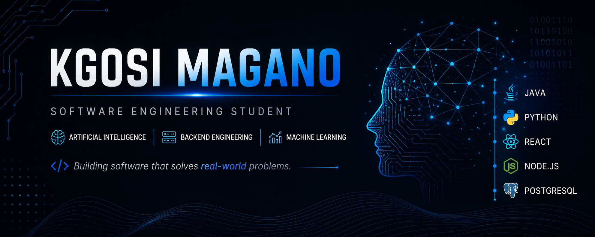

<!-- ===================================================== -->
<!--                  CUSTOM BANNER                        -->
<!-- Replace the src below with your banner later          -->
<!-- Example: assets/banner.png                            -->
<!-- ===================================================== -->

  

  

Software Engineering Student • AI & Backend Developer

---

# 👋 About Me

Hi, I'm **Kgosi Magano**.

I'm a Software Engineering student at **WeThinkCode_** passionate about building intelligent software that solves real-world problems.

My current interests include:

- 🤖 Artificial Intelligence
- 🧠 Machine Learning
- ⚙️ Backend Engineering
- 🏗 Software Architecture

I'm constantly improving my engineering skills through personal projects, open-source contributions, and continuous learning.

---

# 🛠 Tech Stack

### Languages

### Frameworks & Libraries

### Tools

---

# 🚀 Featured Projects

| Project | Description | Technologies |
|---------|-------------|--------------|
| **[📊 ShedSight](https://github.com/MaganoKA17/ShedSight)** | AI-powered productivity analytics platform that transforms productivity data into actionable insights. | Java • PostgreSQL • AI |
| **[🛡 Qaphela](https://github.com/MaganoKA17/Qaphela)** | AI-assisted scam detection platform that analyses SMS and WhatsApp messages using language analysis and URL inspection. | JavaScript • Node.js • AI |

---

# 📈 GitHub Statistics

---

# 🔥 GitHub Streak

---

# 📊 Contribution Activity

---

# 💼 Experience

## Software Engineering Student

**WeThinkCode_**

- Java Development
- Python Programming
- Agile Software Development
- Test-Driven Development
- Brownfield Development

## Volunteer Placement Facilitator

Helping students prepare for employment through work-readiness workshops, industry engagement, and career development initiatives.

---

# 🎯 Currently Learning

- [x] Brownfield Development
- [x] Backend Engineering
- [x] Clean Code
- [x] Artificial Intelligence
- [ ] Machine Learning
- [ ] Deep Learning
- [ ] MLOps

---

# 🎯 2026 Goals

- 🚀 Build production-ready AI applications
- 🤖 Learn Deep Learning
- 🌍 Contribute to Open Source
- 💼 Secure an AI / Software Engineering Internship
- 📚 Continue mastering Java and Python

---

# 🤝 Connect

---

---

> **"Designing intelligent software that solves real-world problems."**

